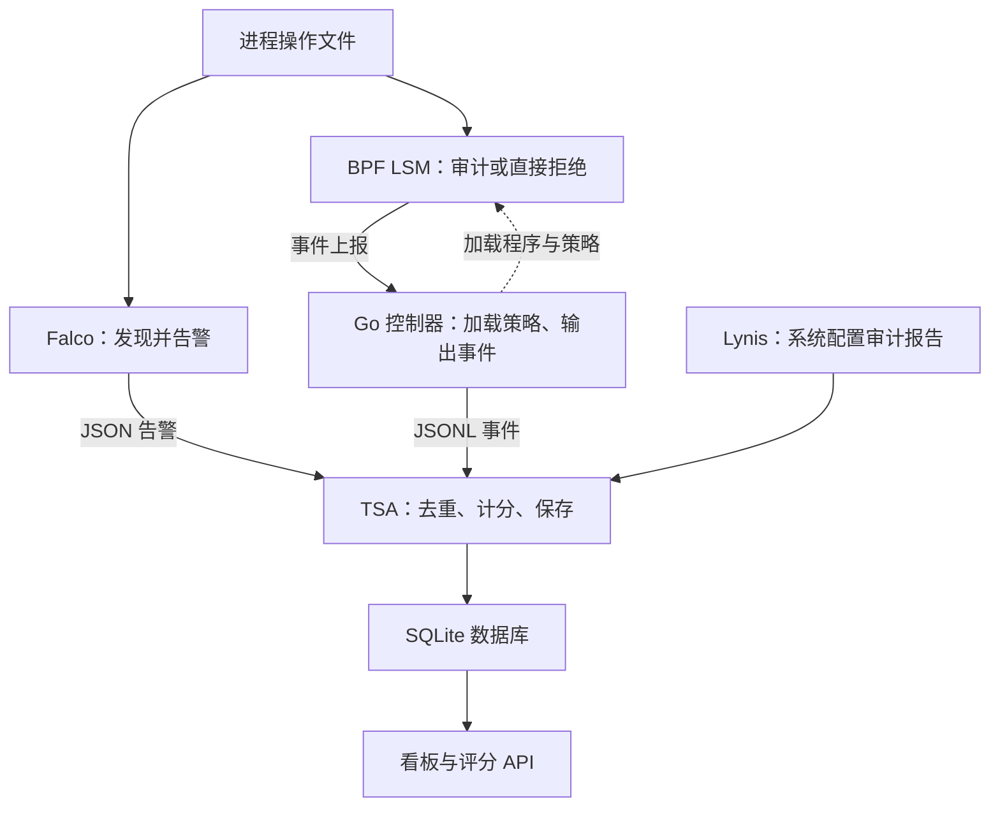

# Linux 主机运行时安全系统

Falco 发现可疑行为，BPF LSM 审计或阻断受保护文件操作，TSA 汇总事件与 Lynis 基线，提供风险评分和看板。

- 首次安装与验收：[Ubuntu 复现指南](docs/INSTALL.md)
- 规则位置与自定义：[Falco 规则指南](docs/FALCO_RULES.md)
- 每条规则的含义与排查：[82 条启用规则解析](docs/FALCO_RULES_README.md)

## 工作流程

这是文件操作的主要数据流；Falco 还检测进程、网络和容器行为。Go 控制器先加载内核程序和策略，BPF LSM 直接作出放行或拒绝决定，不等待 TSA 评分。看板另外读取服务状态和策略配置。

## 部署与使用

支持 Ubuntu 22.04 x86_64；完整模式需要 BTF、已启用的 BPF LSM 和可用网络。按安装指南准备依赖、克隆、生成基线并部署，`git clone` 本身不会启动服务。

- 默认 `audit`：记录并放行；`enforce`：拒绝命中的操作，返回 `EPERM`。切换和验收步骤见安装指南。
- 无 BPF LSM 时降级为 Falco + TSA + 看板，不具备内核阻断能力。
- 看板：`http://127.0.0.1:8766/`；评分：`GET /systemManage/risk/score`。远程使用 SSH 转发或有鉴权的 TLS 代理，不直接开放端口。
- 评分为 `0.4 * posture + 0.6 * runtime`，越低风险越高；基线分不等于 Lynis 原始 hardening index。基线或采集不可用时，接口返回 HTTP 503、`data:null`。
- 升级按安装指南重新部署，不要只替换个别 Python 文件。

## 代码与配置

| 文件 | 作用 |
|---|---|
| `deploy-security-stack.sh` | 总入口：测试、构建、安装并启动服务 |
| `bpf/lsm_block_write.c`、`bpf/vmlinux.h` | 内核阻断源码及类型定义 |
| `lsmbpf_x86_bpfel.go/.o` | 生成的 Go 绑定与 BPF 对象，控制器编译加载需要 |
| `main.go`、`policy.go`、`go.mod/go.sum` | 控制器、策略校验与 Go 依赖 |
| `policy.yaml` | 受保护文件、audit/enforce 模式与允许 UID |
| `falco/manage_rules.py`、`falco/deploy-host-falco.sh` | 校验、安装规则，配置 Falco 日志与服务 |
| `falco/official-rules/`、`falco/rules.lock.json` | 固定官方规则与完整性校验 |
| `falco/rules.d/` | 演示规则、自定义入口、告警例外 |
| `tsa/tsa_fusion.py`、`tsa/tsa_core.py` | TSA 启动入口、事件融合与 SQLite 持久化 |
| `tsa/tsa_dashboard.py`、`tsa/policy_config.yaml` | 只读看板与 API、评分和数据路径配置 |
| `systemd/`、`logrotate/` | 服务模板、日志轮转配置 |
| `*_test.go`、`tsa/tests/` | 部署前执行的回归检查 |

官方规则共 93 条定义，其中 81 条默认启用、12 条默认关闭；另有 1 条启用的项目演示规则。只增加自定义规则时修改 `falco/rules.d/91-custom-rules.yaml`，然后按规则指南校验并部署。

日志在 `/var/log/falco/falco.json`、`/var/log/bpf-lsm/events.jsonl`；数据库在 `tsa/state/tsa.db`，报告在 `tsa/reports/`。这些运行数据不提交 Git，也不应随源码精简删除。

## 使用边界

- 保护按 device/inode 匹配，涵盖写入、删除、重命名、属性和共享可写映射；文件重建后须刷新策略，不提供父目录下新建文件的全面拦截。
- 控制器停止或重启存在保护空窗；已有共享可写映射不会被新策略撤销。从 audit 切到 enforce 前验证正常访问和回滚，并重启相关工作负载。
- TSA 和看板不写 BPF 策略；root 仍能更改主机安全配置，回环接口仍信任本机用户。
- Lynis 基线默认一天过期，需手动重新审计；TSA 只读取报告。服务 active 不代表采集正常，需按安装指南触发事件验收。
- 两个事件源可分别扣分；看板按时间、PID 等关联证据，不代表唯一事务。规则匹配和分数都不是入侵定论或生产安全认证。
