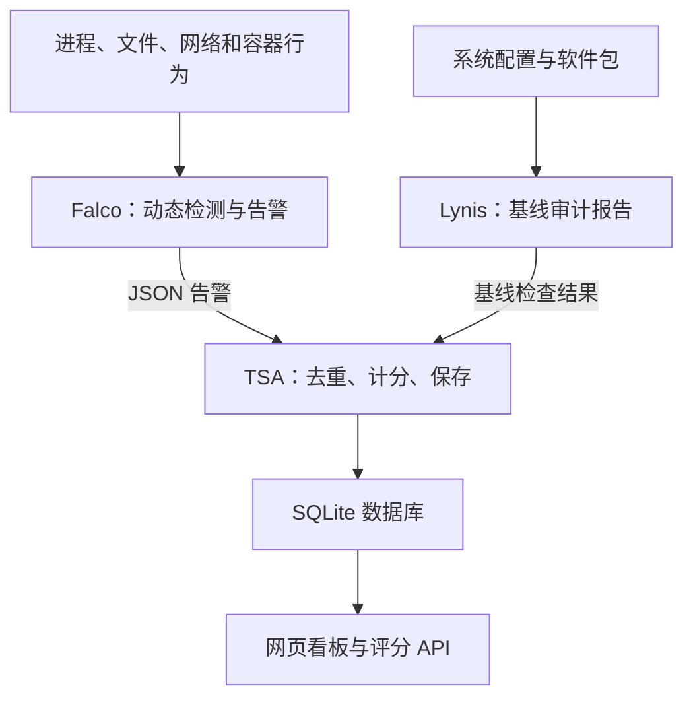

# Linux 主机运行时安全系统

**Lynis 检查系统基线，Falco 持续检测并报警，TSA 去重、计分、保存，通过网页和 API 查看。只监测，不阻断操作或终止进程。**

- [Ubuntu 安装与验收](docs/INSTALL.md)
- [规则位置与自定义](docs/FALCO_RULES.md)
- [82 条启用规则分类与解析](docs/FALCO_RULES_README.md)

## 工作流程

Falco 使用 modern eBPF 采集系统调用，不需要本项目原有的 BPF LSM、Go 控制器或阻断策略。

## 部署与评分

支持 Ubuntu 22.04 x86_64。按安装指南准备依赖、克隆、生成 Lynis 报告并部署，`git clone` 本身不会启动服务。

**全新系统复现已验证（2026-09-18）**：VMware 中的 Ubuntu Server 22.04.5 官方云镜像，默认 5.15.0-190 内核，Falco 0.44.1。按指南从 GitHub 克隆完成部署，63 项回归测试通过，真实文件写入告警入库、评分 API、网页和重启自启动均正常。不需要 Go、BPF LSM 或修改 GRUB；其他系统环境及全部规则攻击覆盖不在本次验证范围内。

- 看板：`http://127.0.0.1:8766/`；评分：`GET /systemManage/risk/score`。远程使用 SSH 转发，不直接开放端口。
- 默认综合分 = 基线分 × 40% + 运行时分 × 60%，越低风险越高。基线分按选定 Lynis 项扣分，不等于 Lynis 原始 hardening index。
- Falco 事件支持去重、限额、每规则封顶和风险到期；历史扣分不等于当前总分变化。基线过期或采集异常时评分不可用。
- 从旧版升级须重新执行部署脚本：停用并备份移除旧控制器，保留历史数据，旧 BPF 事件不再参与评分。

## 代码与配置

| 文件 | 作用 |
|---|---|
| `deploy-security-stack.sh` | 部署入口：测试、安装规则、迁移旧服务并启动 |
| `falco/manage_rules.py`、`falco/deploy-host-falco.sh` | 校验安装规则，配置 Falco 日志与服务 |
| `falco/official-rules/`、`falco/rules.lock.json` | 固定官方规则快照与完整性校验 |
| `falco/rules.d/` | 演示规则、自定义入口和组件告警例外 |
| `tsa/tsa_fusion.py`、`tsa/tsa_core.py` | TSA 启动入口、基线读取、事件计分和 SQLite 持久化 |
| `tsa/tsa_dashboard.py` | 只读网页、健康接口、评分 API |
| `tsa/policy_config.yaml` | 评分、权重、数据路径及有效期 |
| `tsa/verify_runtime.py` | 真实文件操作与 Falco 入库验证 |
| `systemd/`、`logrotate/`、`tsa/tests/` | 服务、日志轮转、回归测试 |

官方规则共 93 条定义：81 条默认启用、12 条默认关闭；加上 1 条项目规则，共 82 条默认启用定义。匹配告警不等于确认入侵，也不保证覆盖所有攻击。

日志为 `/var/log/falco/falco.json`；数据库为 `tsa/state/tsa.db`；基线和评分报告在 `tsa/reports/`。运行数据不提交 Git。Lynis 默认手动审计，报告一天后过期；服务 active 不代表检测验证成功。
