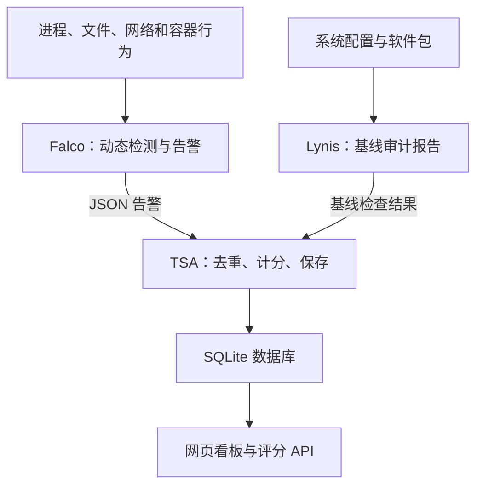

# Linux 主机运行时安全系统

**Lynis 检查系统基线，Falco 持续检测并报警，TSA 去重、计分、保存，通过网页和 API 查看。只监测，不阻断操作或终止进程。**

- [Ubuntu 安装与验收](docs/INSTALL.md)
- [规则位置与自定义](docs/FALCO_RULES.md)
- [30 条默认规则、分值与完整规则解析](docs/FALCO_RULES_README.md)
- [主系统对接：查询分数、设置权重](docs/INSTALL.md#6-主系统对接)

## 工作流程

Falco 使用 modern eBPF 采集系统调用，不需要本项目原有的 BPF LSM、Go 控制器或阻断策略。

## 部署与评分

支持 Ubuntu 22.04 x86_64。按安装指南准备依赖、克隆并部署，部署自动生成 Lynis 报告；`git clone` 本身不会启动服务。

**验证（2026-09-20）**：在既有 2IIE-OS（Ubuntu 22.04.5、Falco 0.44.1）通过 141 项回归，验证了真实系统读取免扣分、演示告警独立计分、评分接口对账。未重新验证新装系统，也未逐条攻击实测全部规则。

上一版 `17037ca` 已在全新 Ubuntu Server 22.04.5 云镜像（5.15.0-190 内核）完成克隆部署和重启验证；该结论不替代当前版本的全新系统验证。不需要 Go、BPF LSM 或修改 GRUB。

- 看板：`http://127.0.0.1:8766/`；评分：`GET /systemManage/risk/score`。远程使用 SSH 转发，不直接开放端口。
- 默认综合分 = 基线分 × 40% + 运行时分 × 60%，越低风险越高。基线分按选定 Lynis 项扣分，不等于 Lynis 原始 hardening index。
- 主系统通过认证接口设置权重、查询三个分数并展示；综合分统一由 TSA 计算。0.4/0.6 仅为初始默认值，接口设置持久保存、立即生效，评分响应包含实际权重及版本。
- 同规则有效风险取峰值，五类弱线索合计最多 15 分；符合严格系统读取上下文的事件仅提示。专用演示规则独立验收，不扣实际分。分值及有效期逐条配置，不按 priority 自动扣分；历史扣分不等于当前总分变化。基线过期或采集异常时评分不可用。
- 从旧版升级须重新执行部署脚本：停用并备份移除旧控制器，保留历史数据，旧 BPF 事件不再参与评分。

## 代码与配置

| 文件 | 作用 |
|---|---|
| `deploy-security-stack.sh` | 部署入口：测试、安装规则、迁移旧服务并启动 |
| `falco/manage_rules.py`、`falco/deploy-host-falco.sh` | 校验安装规则，配置 Falco 日志与服务 |
| `falco/official-rules/`、`falco/rules.lock.json` | 固定官方规则快照与完整性校验 |
| `falco/rules.d/` | 默认规则开关、演示规则、自定义入口和组件告警例外 |
| `tsa/tsa_fusion.py`、`tsa/tsa_core.py` | TSA 启动入口、基线读取、事件计分和 SQLite 持久化 |
| `tsa/baseline_scoring.py` | Lynis 证据解析、逐检查项计分、执行覆盖与报告有效期 |
| `tsa/refresh_baseline.py`、`systemd/tsa-baseline.*` | root 定时扫描、验证并原子发布统一基线报告 |
| `tsa/tsa_dashboard.py` | 只读网页、健康和评分 API、认证权重管理 API |
| `tsa/weight_policy.py` | 权重校验、持久化、版本历史与综合分统一计算 |
| `tsa/policy_config.yaml` | 评分、权重、数据路径及有效期 |
| `tsa/verify_runtime.py` | 真实文件操作与 Falco 入库验证 |
| `systemd/`、`logrotate/`、`tsa/tests/` | 服务、日志轮转、回归测试 |

默认启用 30 条主机告警规则（29 条官方规则 + 1 条独立验收规则）。`falco/rules.d/89-host-profile.yaml` 选择官方规则，`tsa/policy_config.yaml` 指定分值、上下文和预算；其余定义保留但关闭，不覆盖完整容器/云平台场景。匹配告警不等于确认入侵。

日志为 `/var/log/falco/falco.json`；数据库为 `tsa/state/tsa.db`；评分报告为 `tsa/reports/last_scan.json`，基线为 `/var/lib/tsa-baseline/lynis-report.dat`。Lynis 部署时、每 6 小时及开机后自动扫描，TSA 每 30 秒重读。扫描失败不覆盖完整旧报告，报告过期仍会显示未评估。运行数据不提交 Git；真实告警及扣分验收见安装指南第 4 节。
